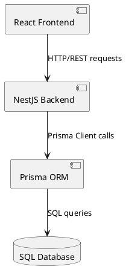
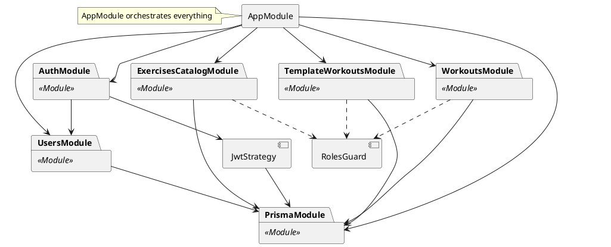
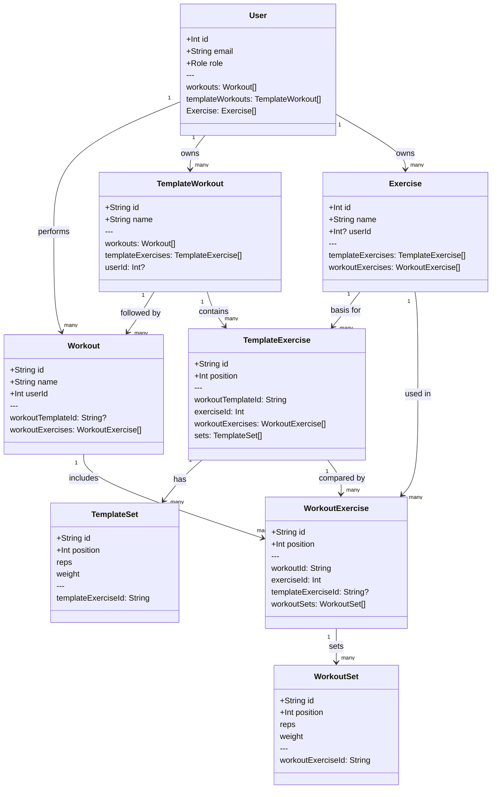
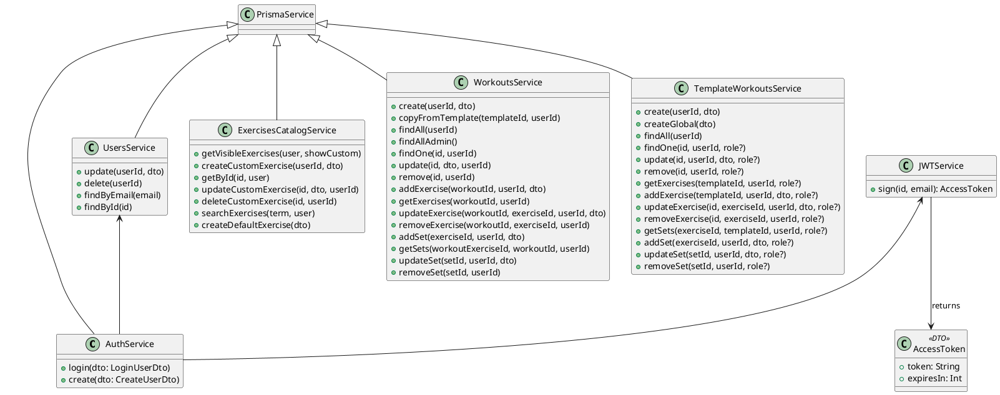
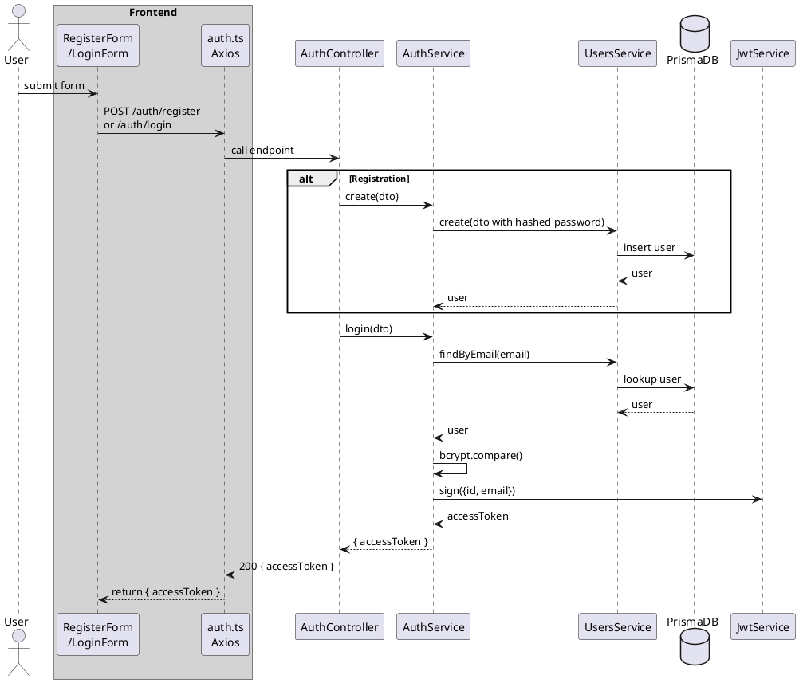
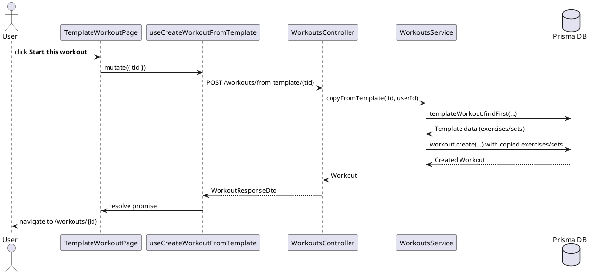
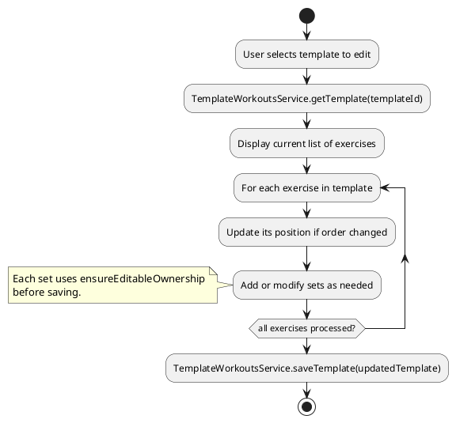
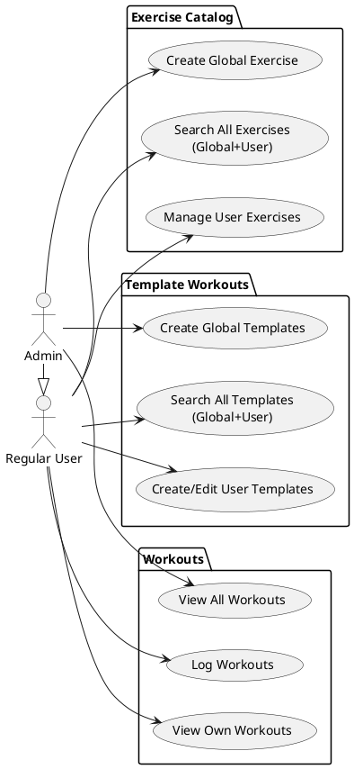
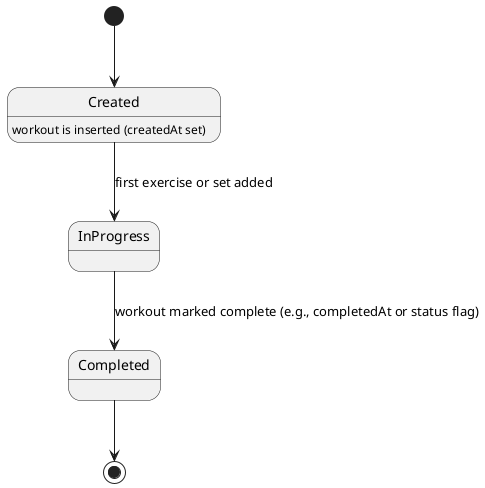

# Architecture Component Diagram

---

# Backend Package/Module Diagram

---

# Persistance Layer Class Diagram

---

# Core Backend Services Class Diagram

---

---
# Registration/Login Sequence Diagram

---

# Workout Creation From Template Sequence Diagram
---

---
# Template Workout Sequence Diagram

# Roles and Permissions Use-Case Diagram

---
# Workout Lifecycle State Diagram

---

