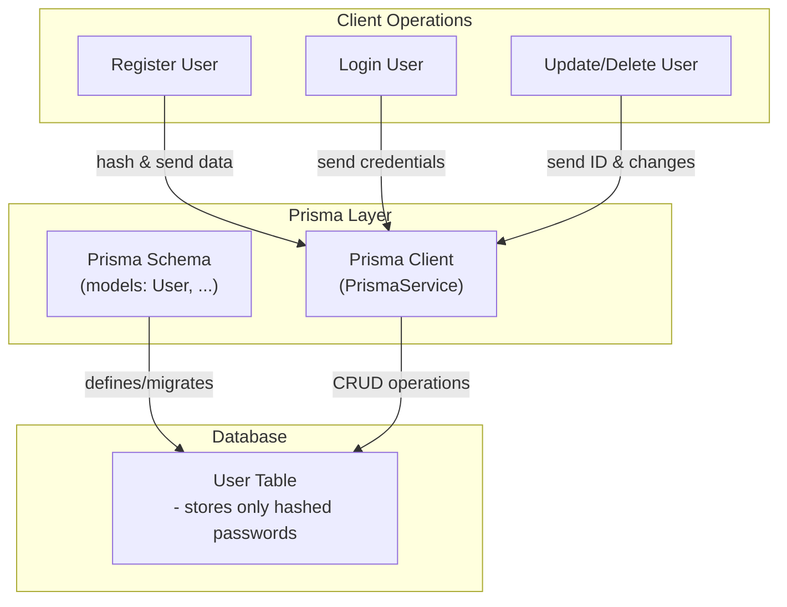

#backend #auth #Database
## 🔍 What Is Prisma?

**Prisma** is a **next-generation ORM (Object-Relational Mapper)** for Node.js and TypeScript.

It helps you:
- Define your **data models** in a single schema file (`schema.prisma`)
- Generate **[[type-safe]] database client code**
- Run [**migrations**](migration) to manage schema changes
- Query the database with a **[[Fluent API]]**

---
## 🔗 How Prisma Works in a Node/Nest App

### 📁 1. Define Schema

You define your models in `prisma/schema.prisma` like this:
``` prisma
model User {
  id       Int      @id @default(autoincrement())
  email    String   @unique
  password String
  name     String?
  createdAt DateTime @default(now())
}
```
This is similar to a DB schema but written in Prisma's DSL.

---
### 🏗️ 2. Generate [[Client]]

You run:
``` bash
npx prisma migrate dev --name init
```
This does **three things**:

1. Creates or updates your SQLite database (or Postgres in prod)
    
2. Generates SQL migration files
    
3. Creates a fully-typed `PrismaClient` class in `node_modules/.prisma`

## [[Prisma-Generate vs Migrate Dev]]

---
### 🔧 3. Use Prisma in Node.js

In a plain Node app, you might write:
``` ts
import { PrismaClient } from '@prisma/client';

const prisma = new PrismaClient();

const user = await prisma.user.findUnique({
  where: { email: 'declan@example.com' },
});
```
---
## 🧱 How Prisma Is Used in **NestJS**

### Step 1: Create a `PrismaService`

You typically create a global `PrismaService` that extends `PrismaClient`:
``` ts
// src/prisma/prisma.service.ts
import { Injectable, OnModuleInit } from '@nestjs/common';
import { PrismaClient } from '@prisma/client';

@Injectable()
export class PrismaService extends PrismaClient implements OnModuleInit {
  async onModuleInit() {
    await this.$connect();
  }
}
```
This lets you inject Prisma like any other Nest provider.

---
### Step 2: Create `PrismaModule`
``` ts
// src/prisma/prisma.module.ts
import { Global, Module } from '@nestjs/common';
import { PrismaService } from './prisma.service';

@Global()
@Module({
  providers: [PrismaService],
  exports: [PrismaService],
})
export class PrismaModule {}
```
Marking it as `@Global()` means you can use `PrismaService` anywhere without re-importing it into each module.

---
### Step 3: Inject PrismaService Where Needed
In a `UserService`, for example:
``` ts
import { PrismaService } from '../prisma/prisma.service';

@Injectable()
export class UserService {
  constructor(private prisma: PrismaService) {}

  async getUserByEmail(email: string) {
    return this.prisma.user.findUnique({ where: { email } });
  }
}
```
Now you have **type-safe DB access** with autocompletion, validation, and TS support.

---
### 🧠 Summary
|Feature|Prisma|
|---|---|
|Schema Definition|`schema.prisma` DSL|
|DB Migration|`npx prisma migrate dev`|
|Code Generation|`PrismaClient` class with typed queries|
|Nest Integration|Use a `PrismaService` + `PrismaModule`|
|Querying|Like `.findUnique`, `.create`, `.update`, etc.|
