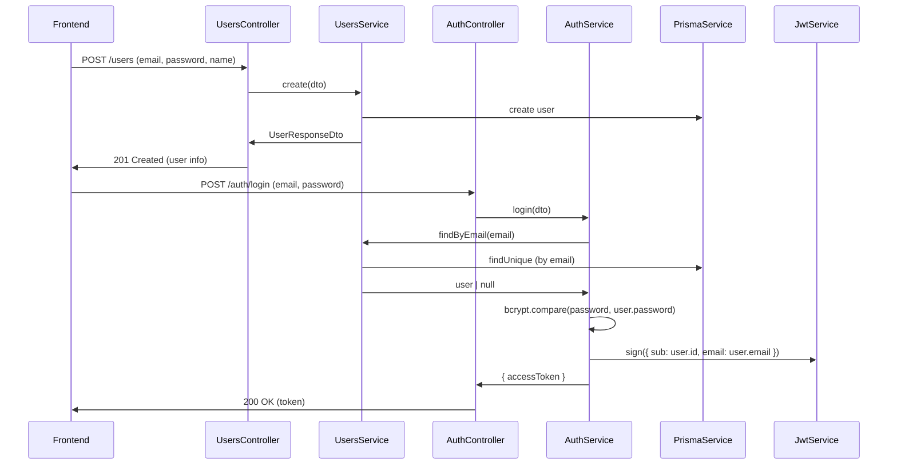

#API #auth #backend 
# 🛠️ **User & Auth Flow Overview**

---

## **A. User Registration**

1. **Frontend** sends `POST /users` with `{ email, password, name }`.

2. **users.controller.ts**
    - Handles `@Post() create()`
    - Receives `CreateUserDto`
    - Calls `users.service.create(dto)`

3. **users.service.ts**
    - Hashes password (`bcrypt.hash`)
    - Checks email uniqueness (via Prisma error code)
    - Creates user in DB (`prisma.user.create`)
    - Returns user info via `UserResponseDto` (never includes password)

4. **users.module.ts**
    - Registers `UsersController` and `UsersService` for DI

---
## **B. User Login (Authentication)**

1. **Frontend** sends `POST /auth/login` with `{ email, password }`.

2. **auth.controller.ts**
    - Handles `@Post('login') login()`
    - Receives `LoginUserDto`
    - Calls `auth.service.login(dto)`

3. **auth.service.ts**
    - Uses `usersService.findByEmail(email)` to fetch the user
    - If user not found, throws `UnauthorizedException`
    - Compares passwords with `bcrypt.compare`
    - If invalid, throws `UnauthorizedException`
    - If valid, signs a JWT (`jwtService.sign({ sub: user.id, email: user.email })`)
    - Returns `{ accessToken }` (optionally: with user info)

4. **auth.module.ts**
    - Imports `UsersModule` and `JwtModule`
    - Registers `AuthController` and `AuthService` for DI

---

## **C. Dependency Injection/Module Cohesion**

- **UsersModule** exports `UsersService`
    
- **AuthModule** imports `UsersModule` (so it can inject/use `UsersService`)
    
- **AuthService** calls user lookup logic but never writes directly to the DB
    
- **Controllers** just orchestrate request/response; all real logic in services

---

## **D. JWT Usage (Once Logged In)**

- The frontend stores the `accessToken` returned by `/auth/login`
    
- For protected endpoints, it sends the token as an `Authorization: Bearer <token>` header
    
- (Later) Your app will add a JWT Guard to controllers, parsing and validating this token

---

# **Flowchart-style Summary**
*Note this was made by ChatGPT*

---

## **Key Takeaways**

- **UsersModule** = CRUD for user data
    
- **AuthModule** = login, JWT, authentication/authorization
    
- **Cohesion:** Auth uses UsersService (but not the other way)
    
- **All password handling** and **JWT logic** is kept out of controllers—only in services!