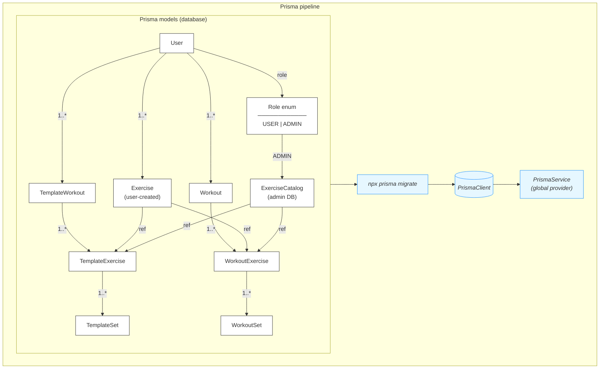
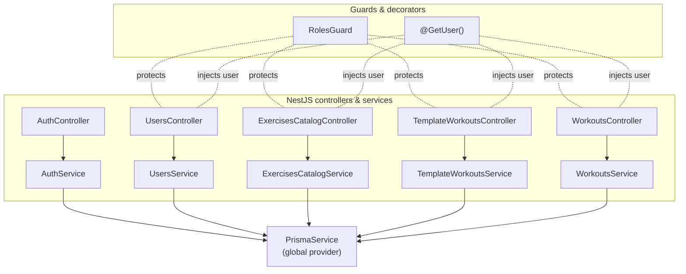

---

```mermaid
flowchart TD
  %% ─────────────────────────────────────────────
  %% DATABASE & ENUMS
  %% ─────────────────────────────────────────────
  classDef model  fill:#fff,stroke:#333,stroke-width:1px;
  classDef schema fill:#f3f3f3,stroke:#777,stroke-width:1px,stroke-dasharray: 4 2;
  classDef process fill:#e6f7ff,stroke:#1e90ff,stroke-width:1px,font-style:italic;
  classDef ctrl   fill:#eef4ff,stroke:#3366cc,stroke-width:1px;
  classDef guard  fill:#ffecec,stroke:#cc3333,stroke-width:1px;
  
  
  %% ─────────────────────────────────────────────
  %% PRISMA PIPELINE
  %% ─────────────────────────────────────────────
  subgraph "Prisma pipeline"
    subgraph PrismaModels ["Prisma models (database)"]
	    direction TB
	    RoleEnum["Role enum<br>────────────<br>USER | ADMIN"]:::model
	    User["User"]:::model
	    Exercise["Exercise<br>(user-created)"]:::model
	    ExerciseCatalog["ExerciseCatalog<br>(admin DB)"]:::model
	    TemplateWorkout["TemplateWorkout"]:::model
	    TemplateExercise["TemplateExercise"]:::model
	    TemplateSet["TemplateSet"]:::model
	    Workout["Workout"]:::model
	    WorkoutExercise["WorkoutExercise"]:::model
	    WorkoutSet["WorkoutSet"]:::model
	
	    %% Relationships
	    User -->|"role"| RoleEnum
	    RoleEnum -- ADMIN --> ExerciseCatalog
	
	    User -->|"1..*"| Workout
	    User -->|"1..*"| TemplateWorkout
	    User -->|"1..*"| Exercise
	
	    TemplateWorkout -->|"1..*"| TemplateExercise
	    TemplateExercise -->|"1..*"| TemplateSet
	
	    Workout -->|"1..*"| WorkoutExercise
	    WorkoutExercise -->|"1..*"| WorkoutSet
	
	    Exercise -->|"ref"| TemplateExercise
	    Exercise -->|"ref"| WorkoutExercise
	    ExerciseCatalog -->|"ref"| TemplateExercise
	    ExerciseCatalog -->|"ref"| WorkoutExercise
	  end

    Migrate["npx prisma migrate"]:::process
    PrismaClient[("PrismaClient")]:::process
    PrismaService["PrismaService<br>(global provider)"]:::process
    PrismaModels --> Migrate --> PrismaClient --> PrismaService
  end

  

```

``` mermaid
flowchart TD
  %% ─────────────────────────────────────────────
  %% NESTJS CONTROLLERS & SERVICES
  %% ─────────────────────────────────────────────
  subgraph "NestJS controllers & services"
    direction TB
    %% controllers
    AuthCtrl["AuthController"]:::ctrl
    UsersCtrl["UsersController"]:::ctrl
    ExCtrl["ExercisesCatalogController"]:::ctrl
    TwCtrl["TemplateWorkoutsController"]:::ctrl
    WkCtrl["WorkoutsController"]:::ctrl

    %% services
    AuthService["AuthService"]
    UsersService["UsersService"]
    ExercisesCatalogService["ExercisesCatalogService"]
    TemplateWorkoutsService["TemplateWorkoutsService"]
    WorkoutsService["WorkoutsService"]


    %% wiring
    AuthCtrl --> AuthService
    UsersCtrl --> UsersService
    ExCtrl   --> ExercisesCatalogService
    TwCtrl   --> TemplateWorkoutsService
    WkCtrl   --> WorkoutsService

    
    
  end
	  AuthService --> PrismaService
    UsersService --> PrismaService
    ExercisesCatalogService --> PrismaService
    TemplateWorkoutsService --> PrismaService
    WorkoutsService --> PrismaService
  
  %% ─────────────────────────────────────────────
  %% GUARDS & DECORATORS
  %% ─────────────────────────────────────────────
  subgraph "Guards & decorators"
    RolesGuard["RolesGuard"]:::guard
    GetUser["@GetUser()"]:::guard
  end
 PrismaService["PrismaService<br>(global provider)"]:::process
  
  %% Show request pipeline (dashed arrows for middleware-style flow)
  RolesGuard -. protects .- UsersCtrl
  RolesGuard -. protects .- ExCtrl
  RolesGuard -. protects .- TwCtrl
  RolesGuard -. protects .- WkCtrl

  GetUser -. injects user .- UsersCtrl
  GetUser -. injects user .- ExCtrl
  GetUser -. injects user .- TwCtrl
  GetUser -. injects user .- WkCtrl
```

``` mermaid
flowchart RL
  %% ─────────────────────────────────────
  %% Global Providers / Guards
  %% ─────────────────────────────────────
  subgraph "Auth flow"
    direction TB
    JwtAuthGuard["AuthGuard('jwt')"]
    JwtStrategy["JwtStrategy"]
    JwtAuthGuard --> JwtStrategy
    RolesGuard
    GetUser["@GetUser()"]
  end

  PrismaService["PrismaService"]:::process

  %% ─────────────────────────────────────
  %% AuthController
  %% ─────────────────────────────────────
  subgraph "auth.controller.ts"
    AL1["POST /auth/login"]:::endpoint --> AL1svc["AuthService.login()"]
    AL2["POST /auth/register"]:::endpoint --> AL2svc["AuthService.create()"]
  end
    AL1svc --> UsersService_findByEmail["UsersService.findByEmail()"] --> PrismaService.user.findUnique
    AL2svc --> PrismaService.user.create
    AL2svc --> AL1svc

  %% ─────────────────────────────────────
  %% UsersController
  %% ─────────────────────────────────────
  subgraph "users.controller.ts"
    direction TB
    UC1["GET /users/me"]:::endpoint --> USVC1["UsersService.findById()"]
    UC2["PATCH /users/me"]:::endpoint --> USVC2["UsersService.update()"]
    UC3["DELETE /users/me"]:::endpoint --> USVC3["UsersService.delete()"]
  end
    UC1 -.-> GetUser
    UC2 -.-> GetUser
    UC3 -.-> GetUser
    UC1 --> JwtAuthGuard
    UC2 --> JwtAuthGuard
    UC3 --> JwtAuthGuard
    USVC1 --> PrismaService.user.findUnique
    USVC2 --> PrismaService.user.update
    USVC3 --> PrismaService.user.delete

  %% ─────────────────────────────────────
  %% ExercisesCatalogController
  %% ─────────────────────────────────────
  subgraph "exercises.controller.ts"
    EX1["POST /exercises-catalog/default"]:::endpoint --> EXS1["ExercisesCatalogService.createDefaultExercise()"]
    EX2["GET /exercises-catalog/search"]:::endpoint --> EXS2["ExercisesCatalogService.searchExercises()"]
    EX3["GET /exercises-catalog/:id"]:::endpoint --> EXS3["ExercisesCatalogService.getById()"]
    EX4["POST /exercises-catalog/custom"]:::endpoint --> EXS4["ExercisesCatalogService.createCustomExercise()"]
    EX5["GET /exercises-catalog"]:::endpoint --> EXS5["ExercisesCatalogService.getVisibleExercises()"]
    EX6["PATCH /exercises-catalog/custom/:id"]:::endpoint --> EXS6["ExercisesCatalogService.updateCustomExercise()"]
    EX7["DELETE /exercises-catalog/custom/:id"]:::endpoint --> EXS7["ExercisesCatalogService.deleteCustomExercise()"]
  end
    EX1 -.-> RolesGuard
    EX2 -.-> RolesGuard
    EX3 -.-> RolesGuard
    EX4 -.-> RolesGuard
    EX5 -.-> RolesGuard
    EX6 -.-> RolesGuard
    EX7 -.-> RolesGuard
    EX1 --> JwtAuthGuard
    EX2 --> JwtAuthGuard
    EX3 --> JwtAuthGuard
    EX4 --> JwtAuthGuard
    EX5 --> JwtAuthGuard
    EX6 --> JwtAuthGuard
    EX7 --> JwtAuthGuard
    EX1 --> PrismaService.exercise.create
    EX2 --> PrismaService.exercise.findMany
    EX3 --> PrismaService.exercise.findUnique
    EX4 --> PrismaService.exercise.create
    EX5 --> PrismaService.exercise.findMany
    EX6 --> PrismaService.exercise.update
    EX7 --> PrismaService.exercise.delete

  %% ─────────────────────────────────────
  %% TemplateWorkoutsController
  %% ─────────────────────────────────────
  subgraph "template-workouts.controller.ts"
    TW1["POST /template-workouts"]:::endpoint --> TWS1["TemplateWorkoutsService.create()"]
    TW2["POST /template-workouts/global"]:::endpoint --> TWS2["TemplateWorkoutsService.createGlobal()"]
    TW3["GET /template-workouts"]:::endpoint --> TWS3["TemplateWorkoutsService.findAll()"]
    TW4["GET /template-workouts/:id"]:::endpoint --> TWS4["TemplateWorkoutsService.findOne()"]
    TW5["PATCH /template-workouts/:id"]:::endpoint --> TWS5["TemplateWorkoutsService.update()"]
    TW6["DELETE /template-workouts/:id"]:::endpoint --> TWS6["TemplateWorkoutsService.remove()"]
    TW7["POST /template-workouts/:id/exercises"]:::endpoint --> TWS7["addExercise()"]
    TW8["GET /template-workouts/:id/exercises"]:::endpoint --> TWS8["getExercises()"]
    TW9["PATCH /template-workouts/:id/exercises/:eid"]:::endpoint --> TWS9["updateExercise()"]
    TW10["DELETE /template-workouts/:id/exercises/:eid"]:::endpoint --> TWS10["removeExercise()"]
    TWS11a["POST /template-workouts/:id/exercises/:eid/sets"]:::endpoint --> TS11["addSet()"]
    TWS11b["GET /template-workouts/:id/exercises/:eid/sets"]:::endpoint --> TS12["getSets()"]
    TWS11c["PATCH /template-workouts/:id/exercises/:eid/sets/:sid"]:::endpoint --> TS13["updateSet()"]
    TWS11d["DELETE /template-workouts/:id/exercises/:eid/sets/:sid"]:::endpoint --> TS14["removeSet()"]
  end
    classDef endpoint fill:#ffffcc,stroke:#333;
    TW1 --> JwtAuthGuard
    TW2 --> JwtAuthGuard
    TW3 --> JwtAuthGuard
    TW4 --> JwtAuthGuard
    TW5 --> JwtAuthGuard
    TW6 --> JwtAuthGuard
    TW7 --> JwtAuthGuard
    TW8 --> JwtAuthGuard
    TW9 --> JwtAuthGuard
    TW10 --> JwtAuthGuard
    TWS11a --> JwtAuthGuard
    TWS11b --> JwtAuthGuard
    TWS11c --> JwtAuthGuard
    TWS11d --> JwtAuthGuard

    TW1 -.-> RolesGuard
    TW2 -.-> RolesGuard
    TW3 -.-> RolesGuard
    TW4 -.-> RolesGuard
    TW5 -.-> RolesGuard
    TW6 -.-> RolesGuard
    TW7 -.-> RolesGuard
    TW8 -.-> RolesGuard
    TW9 -.-> RolesGuard
    TW10 -.-> RolesGuard
    TWS11a -.-> RolesGuard
    TWS11b -.-> RolesGuard
    TWS11c -.-> RolesGuard
    TWS11d -.-> RolesGuard

    TWS1 --> PrismaService.templateWorkout.create
    TWS2 --> PrismaService.templateWorkout.create
    TWS3 --> PrismaService.templateWorkout.findMany
    TWS4 --> PrismaService.templateWorkout.findUnique
    TWS5 --> PrismaService.templateWorkout.update
    TWS6 --> PrismaService.templateWorkout.delete
    TWS7 --> PrismaService.templateExercise.create
    TWS8 --> PrismaService.templateExercise.findMany
    TWS9 --> PrismaService.templateExercise.update
    TWS10 --> PrismaService.templateExercise.delete
    TS11 --> PrismaService.templateSet.create
    TS12 --> PrismaService.templateSet.findMany
    TS13 --> PrismaService.templateSet.update
    TS14 --> PrismaService.templateSet.delete

  %% ─────────────────────────────────────
  %% WorkoutsController
  %% ─────────────────────────────────────
  subgraph "workouts.controller.ts"
    WK1["POST /workouts"]:::endpoint --> WKS1["WorkoutsService.create()"]
    WK2["POST /workouts/from-template/:tid"]:::endpoint --> WKS2["WorkoutsService.copyFromTemplate()"]
    WK3["GET /workouts"]:::endpoint --> WKS3["WorkoutsService.findAll()"]
    WK4["GET /workouts/admin"]:::endpoint --> WKS4["WorkoutsService.findAllAdmin()"]
    WK5["GET /workouts/:id"]:::endpoint --> WKS5["WorkoutsService.findOne()"]
    WK6["PATCH /workouts/:id"]:::endpoint --> WKS6["WorkoutsService.update()"]
    WK7["DELETE /workouts/:id"]:::endpoint --> WKS7["WorkoutsService.remove()"]
    WK8["POST /workouts/:id/exercises"]:::endpoint --> WKS8["addExercise()"]
    WK9["GET /workouts/:id/exercises"]:::endpoint --> WKS9["getExercises()"]
    WK10["PATCH /workouts/:id/exercises/:eid"]:::endpoint --> WKS10["updateExercise()"]
    WK11["DELETE /workouts/:id/exercises/:eid"]:::endpoint --> WKS11["removeExercise()"]
    WK12a["POST /workouts/:id/exercises/:eid/sets"]:::endpoint --> WKS12["addSet()"]
    WK12b["GET /workouts/:id/exercises/:eid/sets"]:::endpoint --> WKS13["getSets()"]
    WK12c["PATCH /workouts/:id/exercises/:eid/sets/:sid"]:::endpoint --> WKS14["updateSet()"]
    WK12d["DELETE /workouts/:id/exercises/:eid/sets/:sid"]:::endpoint --> WKS15["removeSet()"]
  end
    WK1 --> JwtAuthGuard
    WK2 --> JwtAuthGuard
    WK3 --> JwtAuthGuard
    WK4 --> JwtAuthGuard
    WK5 --> JwtAuthGuard
    WK6 --> JwtAuthGuard
    WK7 --> JwtAuthGuard
    WK8 --> JwtAuthGuard
    WK9 --> JwtAuthGuard
    WK10 --> JwtAuthGuard
    WK11 --> JwtAuthGuard
    WK12a --> JwtAuthGuard
    WK12b --> JwtAuthGuard
    WK12c --> JwtAuthGuard
    WK12d --> JwtAuthGuard

    WK1 -.-> RolesGuard
    WK2 -.-> RolesGuard
    WK3 -.-> RolesGuard
    WK4 -.-> RolesGuard
    WK5 -.-> RolesGuard
    WK6 -.-> RolesGuard
    WK7 -.-> RolesGuard
    WK8 -.-> RolesGuard
    WK9 -.-> RolesGuard
    WK10 -.-> RolesGuard
    WK11 -.-> RolesGuard
    WK12a -.-> RolesGuard
    WK12b -.-> RolesGuard
    WK12c -.-> RolesGuard
    WK12d -.-> RolesGuard

    WKS1 --> PrismaService.workout.create
    WKS2 --> PrismaService.templateWorkout.findFirst --> PrismaService.workout.create
    WKS3 --> PrismaService.workout.findMany
    WKS4 --> PrismaService.workout.findMany
    WKS5 --> PrismaService.workout.findUnique
    WKS6 --> PrismaService.workout.update
    WKS7 --> PrismaService.workout.delete
    WKS8 --> PrismaService.workoutExercise.create
    WKS9 --> PrismaService.workoutExercise.findMany
    WKS10 --> PrismaService.workoutExercise.update
    WKS11 --> PrismaService.workoutExercise.delete
    WKS12 --> PrismaService.workoutSet.create
    WKS13 --> PrismaService.workoutSet.findMany
    WKS14 --> PrismaService.workoutSet.update
    WKS15 --> PrismaService.workoutSet.delete

```
---

``` mermaid
flowchart TD
  %% ──────────────── Guards & Decorators ────────────────
  subgraph "Security"
    JwtStrategy["JwtStrategy\n(jwt.strategy.ts)"]
    RolesGuard["RolesGuard\n(roles.guard.ts)"]
    GetUser["GetUser Decorator"]
  end

  %% ──────────────── Auth Module ────────────────
  subgraph "AuthController\n(auth.controller.ts)"
    ALogin["POST /auth/login"]
    ARegister["POST /auth/register"]
  end
  subgraph "AuthService\n(auth.service.ts)"
    SLogin["login()"]
    SCreate["create()"]
    UsersFindEmail["UsersService.findByEmail()"]
  end
  ALogin -->|calls| SLogin
  ARegister -->|calls| SCreate
  SLogin --> UsersFindEmail
  SCreate --> PrismaService
  UsersFindEmail --> PrismaService

  %% ──────────────── Users Module ────────────────
  subgraph "UsersController\n(users.controller.ts)"
    GetMe["GET /users/me"]
    PatchMe["PATCH /users/me"]
    DeleteMe["DELETE /users/me"]
  end
  subgraph "UsersService\n(users.service.ts)"
    FindById["findById()"]
    UpdateUser["update()"]
    DeleteUser["delete()"]
  end
  GetMe -->|calls| FindById
  PatchMe -->|calls| UpdateUser
  DeleteMe -->|calls| DeleteUser
  FindById --> PrismaService
  UpdateUser --> PrismaService
  DeleteUser --> PrismaService
  GetUser -.-> GetMe
  GetUser -.-> PatchMe
  GetUser -.-> DeleteMe
  JwtStrategy -. validates .- UsersController

  %% ──────────────── Exercises Catalog Module ────────────────
  subgraph "ExercisesCatalogController\n(exercises.controller.ts)"
    PostDefault["POST /exercises-catalog/default"]
    GetSearch["GET /exercises-catalog/search"]
    GetById["GET /exercises-catalog/:id"]
    PostCustom["POST /exercises-catalog/custom"]
    GetAll["GET /exercises-catalog"]
    PatchCustom["PATCH /exercises-catalog/custom/:id"]
    DeleteCustom["DELETE /exercises-catalog/custom/:id"]
  end
  subgraph "ExercisesCatalogService\n(exercises.service.ts)"
    SCreateDef["createDefaultExercise()"]
    SSearch["searchExercises()"]
    SGetById["getById()"]
    SCreateCustom["createCustomExercise()"]
    SGetVisible["getVisibleExercises()"]
    SUpdateCustom["updateCustomExercise()"]
    SDeleteCustom["deleteCustomExercise()"]
  end
  PostDefault --> SCreateDef --> PrismaService
  GetSearch --> SSearch --> PrismaService
  GetById --> SGetById --> PrismaService
  PostCustom --> SCreateCustom --> PrismaService
  GetAll --> SGetVisible --> PrismaService
  PatchCustom --> SUpdateCustom --> PrismaService
  DeleteCustom --> SDeleteCustom --> PrismaService
  GetUser -.-> PostCustom
  GetUser -.-> GetSearch
  GetUser -.-> GetById
  GetUser -.-> GetAll
  GetUser -.-> PatchCustom
  GetUser -.-> DeleteCustom
  RolesGuard -. protects .- ExercisesCatalogController
  JwtStrategy -. validates .- ExercisesCatalogController

  %% ──────────────── Template Workouts Module ────────────────
  subgraph "TemplateWorkoutsController\n(template-workouts.controller.ts)"
    TWPost["POST /template-workouts"]
    TWPostGlobal["POST /template-workouts/global"]
    TWGetAll["GET /template-workouts"]
    TWGetOne["GET /template-workouts/:id"]
    TWPatch["PATCH /template-workouts/:id"]
    TWDelete["DELETE /template-workouts/:id"]
    TWAddEx["POST /template-workouts/:id/exercises"]
    TWGetEx["GET /template-workouts/:id/exercises"]
    TWPatchEx["PATCH /template-workouts/:id/exercises/:eid"]
    TWDelEx["DELETE /template-workouts/:id/exercises/:eid"]
    TWAddSet["POST /template-workouts/:id/exercises/:eid/sets"]
    TWGetSet["GET /template-workouts/:id/exercises/:eid/sets"]
    TWPatchSet["PATCH /template-workouts/:id/exercises/:eid/sets/:sid"]
    TWDelSet["DELETE /template-workouts/:id/exercises/:eid/sets/:sid"]
  end
  subgraph "TemplateWorkoutsService\n(template-workouts.service.ts)"
    TCreate["create()"]
    TCreateGlobal["createGlobal()"]
    TFindAll["findAll()"]
    TFindOne["findOne()"]
    TUpdate["update()"]
    TRemove["remove()"]
    TAddEx["addExercise()"]
    TGetEx["getExercises()"]
    TUpdateEx["updateExercise()"]
    TRemoveEx["removeExercise()"]
    TAddSet["addSet()"]
    TGetSet["getSets()"]
    TUpdateSet["updateSet()"]
    TRemoveSet["removeSet()"]
  end
  TWPost --> TCreate --> PrismaService
  TWPostGlobal --> TCreateGlobal --> PrismaService
  TWGetAll --> TFindAll --> PrismaService
  TWGetOne --> TFindOne --> PrismaService
  TWPatch --> TUpdate --> PrismaService
  TWDelete --> TRemove --> PrismaService
  TWAddEx --> TAddEx --> PrismaService
  TWGetEx --> TGetEx --> PrismaService
  TWPatchEx --> TUpdateEx --> PrismaService
  TWDelEx --> TRemoveEx --> PrismaService
  TWAddSet --> TAddSet --> PrismaService
  TWGetSet --> TGetSet --> PrismaService
  TWPatchSet --> TUpdateSet --> PrismaService
  TWDelSet --> TRemoveSet --> PrismaService
  GetUser -.-> TWPost
  GetUser -.-> TWGetAll
  GetUser -.-> TWGetOne
  GetUser -.-> TWPatch
  GetUser -.-> TWDelete
  GetUser -.-> TWAddEx
  GetUser -.-> TWGetEx
  GetUser -.-> TWPatchEx
  GetUser -.-> TWDelEx
  GetUser -.-> TWAddSet
  GetUser -.-> TWGetSet
  GetUser -.-> TWPatchSet
  GetUser -.-> TWDelSet
  RolesGuard -. protects .- TemplateWorkoutsController
  JwtStrategy -. validates .- TemplateWorkoutsController

  %% ──────────────── Workouts Module ────────────────
  subgraph "WorkoutsController\n(workouts.controller.ts)"
    WPost["POST /workouts"]
    WPostT["POST /workouts/from-template/:tid"]
    WGet["GET /workouts"]
    WGetAdmin["GET /workouts/admin"]
    WGetOne["GET /workouts/:id"]
    WPatch["PATCH /workouts/:id"]
    WDelete["DELETE /workouts/:id"]
    WAddEx["POST /workouts/:id/exercises"]
    WGetEx["GET /workouts/:id/exercises"]
    WPatchEx["PATCH /workouts/:id/exercises/:eid"]
    WDelEx["DELETE /workouts/:id/exercises/:eid"]
    WAddSet["POST /workouts/:id/exercises/:eid/sets"]
    WGetSet["GET /workouts/:id/exercises/:eid/sets"]
    WPatchSet["PATCH /workouts/:id/exercises/:eid/sets/:sid"]
    WDelSet["DELETE /workouts/:id/exercises/:eid/sets/:sid"]
  end
  subgraph "WorkoutsService\n(workouts.service.ts)"
    WCreate["create()"]
    WCopy["copyFromTemplate()"]
    WFindAll["findAll()"]
    WFindAllAdmin["findAllAdmin()"]
    WFindOne["findOne()"]
    WUpdate["update()"]
    WRemove["remove()"]
    WAddExServ["addExercise()"]
    WGetExServ["getExercises()"]
    WUpdateExServ["updateExercise()"]
    WRemoveExServ["removeExercise()"]
    WAddSetServ["addSet()"]
    WGetSetServ["getSets()"]
    WUpdateSetServ["updateSet()"]
    WRemoveSetServ["removeSet()"]
  end
  WPost --> WCreate --> PrismaService
  WPostT --> WCopy --> PrismaService
  WGet --> WFindAll --> PrismaService
  WGetAdmin --> WFindAllAdmin --> PrismaService
  WGetOne --> WFindOne --> PrismaService
  WPatch --> WUpdate --> PrismaService
  WDelete --> WRemove --> PrismaService
  WAddEx --> WAddExServ --> PrismaService
  WGetEx --> WGetExServ --> PrismaService
  WPatchEx --> WUpdateExServ --> PrismaService
  WDelEx --> WRemoveExServ --> PrismaService
  WAddSet --> WAddSetServ --> PrismaService
  WGetSet --> WGetSetServ --> PrismaService
  WPatchSet --> WUpdateSetServ --> PrismaService
  WDelSet --> WRemoveSetServ --> PrismaService
  GetUser -.-> WPost
  GetUser -.-> WPostT
  GetUser -.-> WGet
  GetUser -.-> WGetOne
  GetUser -.-> WPatch
  GetUser -.-> WDelete
  GetUser -.-> WAddEx
  GetUser -.-> WGetEx
  GetUser -.-> WPatchEx
  GetUser -.-> WDelEx
  GetUser -.-> WAddSet
  GetUser -.-> WGetSet
  GetUser -.-> WPatchSet
  GetUser -.-> WDelSet
  RolesGuard -. protects .- WorkoutsController
  JwtStrategy -. validates .- WorkoutsController

  %% ──────────────── Prisma Service ────────────────
  PrismaService["PrismaService\n(prisma.service.ts)"]

  classDef route fill:#E0F7FA,stroke:#006064;
  classDef service fill:#FFF3E0,stroke:#EF6C00;
  class GetMe,PatchMe,DeleteMe,PostCustom,GetSearch,GetById,GetAll,PatchCustom,DeleteCustom,TWPost,TWPostGlobal,TWGetAll,TWGetOne,TWPatch,TWDelete,TWAddEx,TWGetEx,TWPatchEx,TWDelEx,TWAddSet,TWGetSet,TWPatchSet,TWDelSet,WPost,WPostT,WGet,WGetAdmin,WGetOne,WPatch,WDelete,WAddEx,WGetEx,WPatchEx,WDelEx,WAddSet,WGetSet,WPatchSet,WDelSet route;
  class SLogin,SCreate,UsersFindEmail,FindById,UpdateUser,DeleteUser,SCreateDef,SSearch,SGetById,SCreateCustom,SGetVisible,SUpdateCustom,SDeleteCustom,TCreate,TCreateGlobal,TFindAll,TFindOne,TUpdate,TRemove,TAddEx,TGetEx,TUpdateEx,TRemoveEx,TAddSet,TGetSet,TUpdateSet,TRemoveSet,WCreate,WCopy,WFindAll,WFindAllAdmin,WFindOne,WUpdate,WRemove,WAddExServ,WGetExServ,WUpdateExServ,WRemoveExServ,WAddSetServ,WGetSetServ,WUpdateSetServ,WRemoveSetServ service;

```
---

