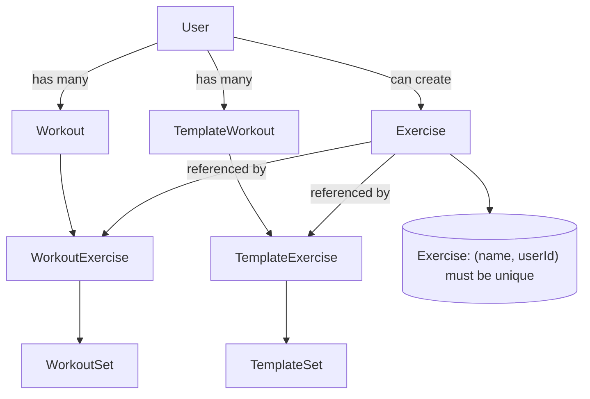
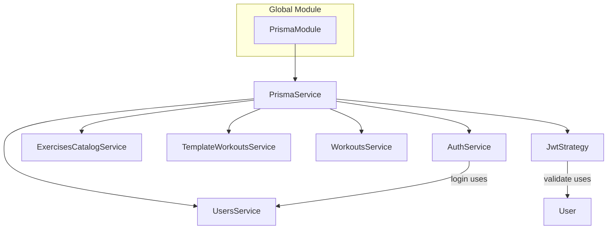
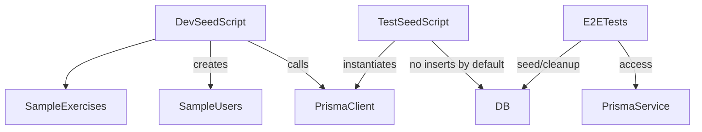
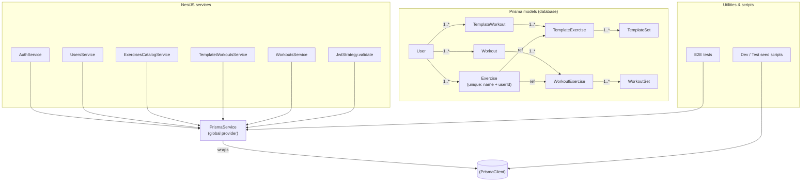
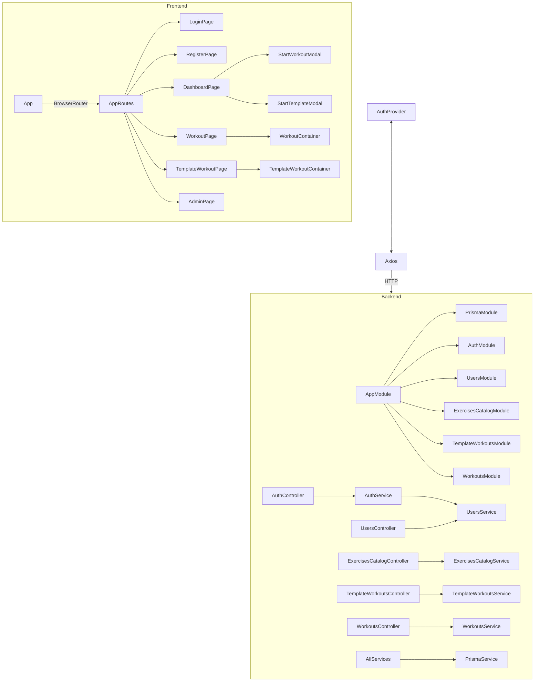
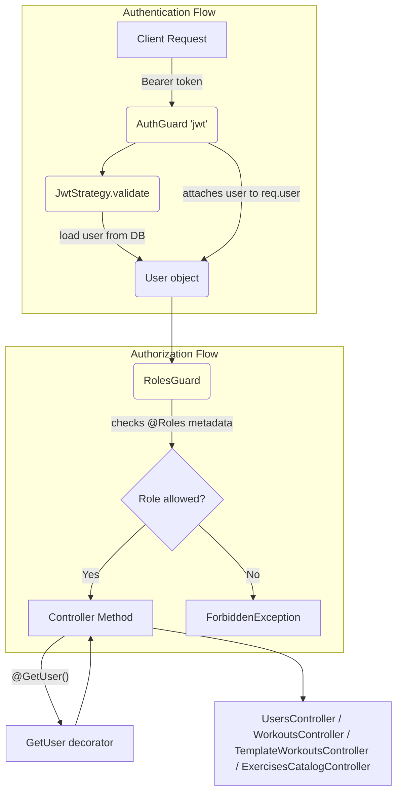
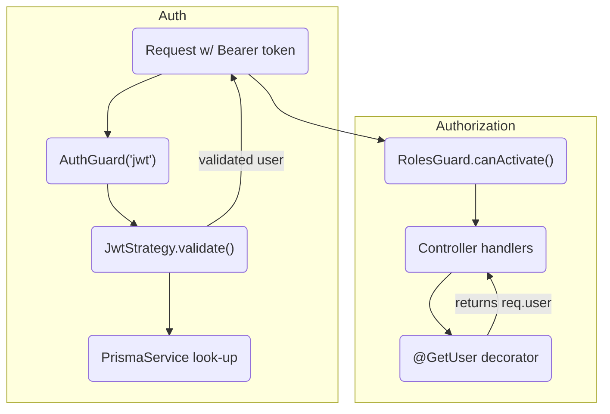

---

``` mermaid
flowchart TD
  User -->|has many| Workout
  User -->|has many| TemplateWorkout
  User -->|can create| Exercise

  TemplateWorkout --> TemplateExercise
  TemplateExercise --> TemplateSet

  Workout --> WorkoutExercise
  WorkoutExercise --> WorkoutSet

  Exercise -->|referenced by| TemplateExercise
  Exercise -->|referenced by| WorkoutExercise

  Note1[("Exercise: (name, userId) must be unique")]
  Exercise --> Note1

```
---

``` mermaid
flowchart TD
  PrismaService --> AuthService
  PrismaService --> UsersService
  PrismaService --> ExercisesCatalogService
  PrismaService --> TemplateWorkoutsService
  PrismaService --> WorkoutsService
  PrismaService --> JwtStrategy

  AuthService -->|login uses| UsersService
  JwtStrategy -->|validate uses| User

  subgraph Global Module
    PrismaModule
  end
  PrismaModule --> PrismaService

```

```mermaid
flowchart TD
  DevSeedScript -->|calls| PrismaClient
  DevSeedScript -->|creates| SampleUsers
  DevSeedScript --> SampleExercises

  TestSeedScript -->|instantiates| PrismaClient
  TestSeedScript -->|no inserts by default| DB

  E2ETests -->|access| PrismaService
  E2ETests -->|seed/cleanup| DB

```

----

``` mermaid
flowchart TD
  %% ─────────────────────────────────────────────
  %% DATABASE LAYER – Prisma models & relations
  %% ─────────────────────────────────────────────
  subgraph "Prisma models (database)"
    direction LR
    User["User"]
    Exercise["Exercise<br>(unique: name + userId)"]
    TemplateWorkout["TemplateWorkout"]
    TemplateExercise["TemplateExercise"]
    TemplateSet["TemplateSet"]
    Workout["Workout"]
    WorkoutExercise["WorkoutExercise"]
    WorkoutSet["WorkoutSet"]

    %% one-to-many ownerships
    User -->|"1..*"| Workout
    User -->|"1..*"| TemplateWorkout
    User -->|"1..*"| Exercise

    %% template hierarchy
    TemplateWorkout -->|"1..*"| TemplateExercise
    TemplateExercise -->|"1..*"| TemplateSet

    %% workout log hierarchy
    Workout -->|"1..*"| WorkoutExercise
    WorkoutExercise -->|"1..*"| WorkoutSet

    %% exercise references
    Exercise -->|"ref"| TemplateExercise
    Exercise -->|"ref"| WorkoutExercise
  end

  %% ─────────────────────────────────────────────
  %% PRISMA CLIENT LAYER – shared access point
  %% ─────────────────────────────────────────────
  PrismaService["PrismaService<br>(global provider)"] -->|wraps| PrismaClient[("(PrismaClient)")]

  %% ─────────────────────────────────────────────
  %% APPLICATION LAYER – NestJS services & strategy
  %% ─────────────────────────────────────────────
  subgraph "NestJS services"
    AuthService["AuthService"]
    UsersService["UsersService"]
    ExercisesCatalogService["ExercisesCatalogService"]
    TemplateWorkoutsService["TemplateWorkoutsService"]
    WorkoutsService["WorkoutsService"]
    JwtStrategy["JwtStrategy.validate"]
  end

  %% every service resolves the shared PrismaService via DI
  AuthService --> PrismaService
  UsersService --> PrismaService
  ExercisesCatalogService --> PrismaService
  TemplateWorkoutsService --> PrismaService
  WorkoutsService --> PrismaService
  JwtStrategy --> PrismaService

  %% ─────────────────────────────────────────────
  %% SUPPORTING UTILITIES
  %% ─────────────────────────────────────────────
  subgraph "Utilities & scripts"
    Seed["Dev / Test seed scripts"]
    E2ETests["E2E tests"]
  end
  Seed --> PrismaClient
  E2ETests --> PrismaService

```
---

---

``` mermaid
flowchart TD
  %% ─────────────────────────────────────────────
  %% DATABASE LAYER – Prisma models & relations
  %% ─────────────────────────────────────────────
  subgraph "Prisma models (database)"
    direction LR
    User["User"]
    Exercise["Exercise<br>(unique: name + userId)"]
    TemplateWorkout["TemplateWorkout"]
    TemplateExercise["TemplateExercise"]
    TemplateSet["TemplateSet"]
    Workout["Workout"]
    WorkoutExercise["WorkoutExercise"]
    WorkoutSet["WorkoutSet"]

    %% one-to-many ownerships
    User -->|"1..*"| Workout
    User -->|"1..*"| TemplateWorkout
    User -->|"1..*"| Exercise

    %% template hierarchy
    TemplateWorkout -->|"1..*"| TemplateExercise
    TemplateExercise -->|"1..*"| TemplateSet

    %% workout log hierarchy
    Workout -->|"1..*"| WorkoutExercise
    WorkoutExercise -->|"1..*"| WorkoutSet

    %% exercise references
    Exercise -->|"ref"| TemplateExercise
    Exercise -->|"ref"| WorkoutExercise
  end

  %% ─────────────────────────────────────────────
  %% PRISMA CLIENT LAYER – shared access point
  %% ─────────────────────────────────────────────
  PrismaService["PrismaService<br>(global provider)"] -->|wraps| PrismaClient[("(PrismaClient)")]

  %% ─────────────────────────────────────────────
  %% APPLICATION LAYER – NestJS services & strategy
  %% ─────────────────────────────────────────────
  subgraph "NestJS services"
    AuthService["AuthService"]
    UsersService["UsersService"]
    ExercisesCatalogService["ExercisesCatalogService"]
    TemplateWorkoutsService["TemplateWorkoutsService"]
    WorkoutsService["WorkoutsService"]
    JwtStrategy["JwtStrategy.validate"]
  end

  %% every service resolves the shared PrismaService via DI
  AuthService --> PrismaService
  UsersService --> PrismaService
  ExercisesCatalogService --> PrismaService
  TemplateWorkoutsService --> PrismaService
  WorkoutsService --> PrismaService
  JwtStrategy --> PrismaService

  %% ─────────────────────────────────────────────
  %% SUPPORTING UTILITIES
  %% ─────────────────────────────────────────────
  subgraph "Utilities & scripts"
    Seed["Dev / Test seed scripts"]
    E2ETests["E2E tests"]
  end
  Seed --> PrismaClient
  E2ETests --> PrismaService

```
---

``` mermaid
graph TD
    subgraph Backend
        AppModule --> PrismaModule
        AppModule --> AuthModule
        AppModule --> UsersModule
        AppModule --> ExercisesCatalogModule
        AppModule --> TemplateWorkoutsModule
        AppModule --> WorkoutsModule
        AuthController --> AuthService
        AuthService --> UsersService
        UsersController --> UsersService
        ExercisesCatalogController --> ExercisesCatalogService
        TemplateWorkoutsController --> TemplateWorkoutsService
        WorkoutsController --> WorkoutsService
        AllServices --> PrismaService
    end

    subgraph Frontend
        App --BrowserRouter--> AppRoutes
        AppRoutes --> LoginPage
        AppRoutes --> RegisterPage
        AppRoutes --> DashboardPage
        AppRoutes --> WorkoutPage
        AppRoutes --> TemplateWorkoutPage
        AppRoutes --> AdminPage
        DashboardPage --> StartWorkoutModal
        DashboardPage --> StartTemplateModal
        WorkoutPage --> WorkoutContainer
        TemplateWorkoutPage --> TemplateWorkoutContainer
    end

    AuthProvider <---> Axios
    Axios -->|HTTP| Backend

```

``` mermaid
flowchart TD
    subgraph Authentication Flow
        A[Client Request] -->|Bearer token| B(AuthGuard 'jwt')
        B --> C(JwtStrategy.validate)
        C -->|load user from DB| D(User object)
        B -->|attaches user to req.user| D
    end

    subgraph Authorization Flow
        D --> E(RolesGuard)
        E -->|checks @Roles metadata| F{Role allowed?}
        F -- Yes --> G[Controller Method]
        F -- No  --> H[ForbiddenException]
    end

    G --> |"@GetUser()"| I[GetUser decorator]
    I --> G

    %% Example controllers using guards
    G --> J[UsersController / WorkoutsController / TemplateWorkoutsController / ExercisesCatalogController]

    classDef guard fill:#ffd;
    class B,C,E guard;

```

```mermaid
flowchart TD
    subgraph Auth
        Request(Request w/ Bearer token)
        JwtGuard("AuthGuard('jwt')")
        JwtStrategy("JwtStrategy.validate()")
        Prisma(PrismaService look‑up)
        Request --> JwtGuard
        JwtGuard --> JwtStrategy
        JwtStrategy --> Prisma
        JwtStrategy -->|validated user| Request
    end

    subgraph Authorization
        RolesGuard("RolesGuard.canActivate()")
        ControllerHandler(Controller handlers)
        GetUserDecorator("@GetUser decorator")
        Request --> RolesGuard
        RolesGuard --> ControllerHandler
        ControllerHandler --> GetUserDecorator
        GetUserDecorator -->|returns req.user| ControllerHandler
    end

```
---
