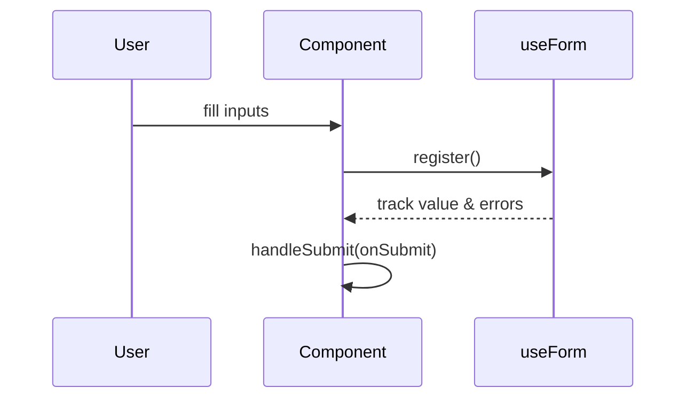

#frontend #auth 
## 🧰 `react-hook-form` (RHF)

### ➤ What it is:

A lightweight form library for React that **minimizes re-renders** and gives you easy access to form state (like `isDirty`, `errors`, `isSubmitting`, etc).

### ➤ Why it's useful:

- **Very performant**: minimal re-renders, even with big forms.
    
- **Clean API**: uses `register`, `handleSubmit`, `watch`, etc.
    
- **Great dev experience**: easy to use, easy to debug.
    

### ➤ How it works:

You “register” each form input with RHF, which tracks and validates it internally. You pass `handleSubmit(onSubmit)` to your `<form>`.

---
## 🧰 `@hookform/resolvers`

### ➤ What it is:

A bridge between `react-hook-form` and validation libraries like Zod.

### ➤ Why it's useful:

- Makes Zod (or Yup, Joi, etc.) usable with RHF in one line.
    
- Centralizes validation logic.
    
- Lets you display field errors easily via RHF.
---
> [!question]+ ## ✅ Why use [[Zod]] and [[React-Hook-Form]] _together_?
> Using RHF with Zod gives you:- Great performance (RHF)
   > 
> - Strong, type-safe validation (Zod)
>    
> - Clean, centralized form logic
 >   
>- Easy error display and API submission handling

---
# useForm
**Definition**  
`useForm` initializes React Hook Form’s state and returns helpers for registration, validation, and submission, optionally wired to a Zod schema via a resolver.

```tsx
import { useForm } from 'react-hook-form';
import { zodResolver } from '@hookform/resolvers/zod';
import { workoutSchema, WorkoutFormValues } from '../schemas/workout';

const { register, handleSubmit, formState: { errors } } = useForm<WorkoutFormValues>({
  resolver: zodResolver(workoutSchema),
  defaultValues: { name: '', sets: [] },
});
```


