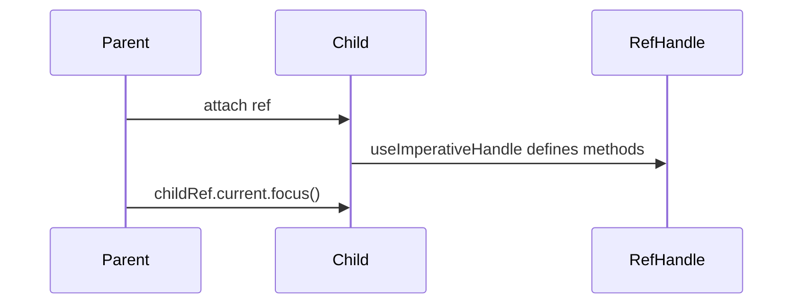

## `forwardRef`

**Definition**  
Wraps a component to pass a ref from parent down to a DOM node or child component.

```tsx
import React, { forwardRef } from 'react';

type InputProps = React.InputHTMLAttributes<HTMLInputElement>;
const TextInput = forwardRef<HTMLInputElement, InputProps>((props, ref) => (
  <input ref={ref} {...props} />
));
export default TextInput;
```

## `useImperativeHandle`

**Definition**  
Customizes the instance value exposed by a ref created via `forwardRef`.

```tsx
import React, { forwardRef, useImperativeHandle, useRef } from 'react';

export interface Handle { focus(): void; }
const FancyInput = forwardRef<Handle>((_, ref) => {
  const inputRef = useRef<HTMLInputElement>(null);
  useImperativeHandle(ref, () => ({
    focus: () => inputRef.current?.focus(),
  }));
  return <input ref={inputRef} />;
});
```

