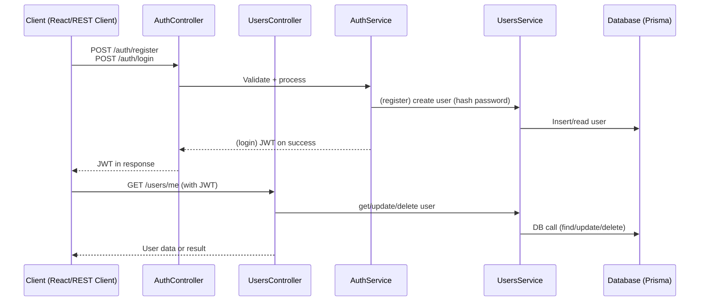
```mermaid
sequenceDiagram
    participant C as Client (React/REST Client)
    participant A as AuthController
    participant U as UsersController
    participant S as AuthService
    participant US as UsersService
    participant DB as Database (Prisma)

    C->>A: POST /auth/register<br>POST /auth/login
    A->>S: Validate + process
    S->>US: (register) create user (hash password)
    US->>DB: Insert/read user
    S-->>A: (login) JWT on success
    A-->>C: JWT in response

    C->>U: GET /users/me (with JWT)
    U->>US: get/update/delete user
    US->>DB: DB call (find/update/delete)
    U-->>C: User data or result

```
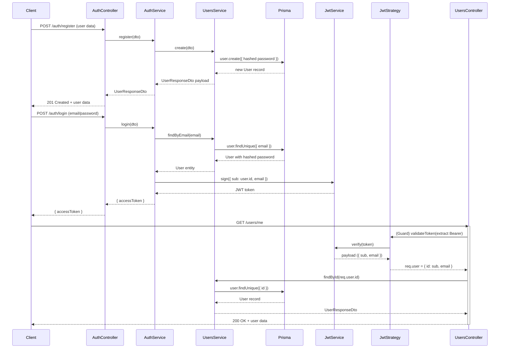
```mermaid
sequenceDiagram
    participant Client
    participant AuthController
    participant AuthService
    participant UsersService
    participant Prisma
    participant JwtService
    participant JwtStrategy
    participant UsersController

    %% Registration
    Client->>AuthController: POST /auth/register (user data)
    AuthController->>AuthService: register(dto)
    AuthService->>UsersService: create(dto)
    UsersService->>Prisma: user.create({ hashed password })
    Prisma-->>UsersService: new User record
    UsersService-->>AuthService: UserResponseDto payload
    AuthService-->>AuthController: UserResponseDto
    AuthController-->>Client: 201 Created + user data

    %% Login
    Client->>AuthController: POST /auth/login (email/password)
    AuthController->>AuthService: login(dto)
    AuthService->>UsersService: findByEmail(email)
    UsersService->>Prisma: user.findUnique({ email })
    Prisma-->>UsersService: User with hashed password
    UsersService-->>AuthService: User entity
    AuthService->>JwtService: sign({ sub: user.id, email })
    JwtService-->>AuthService: JWT token
    AuthService-->>AuthController: { accessToken }
    AuthController-->>Client: { accessToken }

    %% Protected Endpoint (GET /users/me)
    Client->>UsersController: GET /users/me
    activate UsersController
    UsersController->>JwtStrategy: (Guard) validateToken(extract Bearer)
    JwtStrategy->>JwtService: verify(token)
    JwtService-->>JwtStrategy: payload ({ sub, email })
    JwtStrategy-->>UsersController: req.user = { id: sub, email }
    UsersController->>UsersService: findById(req.user.id)
    UsersService->>Prisma: user.findUnique({ id })
    Prisma-->>UsersService: User record
    UsersService-->>UsersController: UserResponseDto
    UsersController-->>Client: 200 OK + user data
    deactivate UsersController
```

---

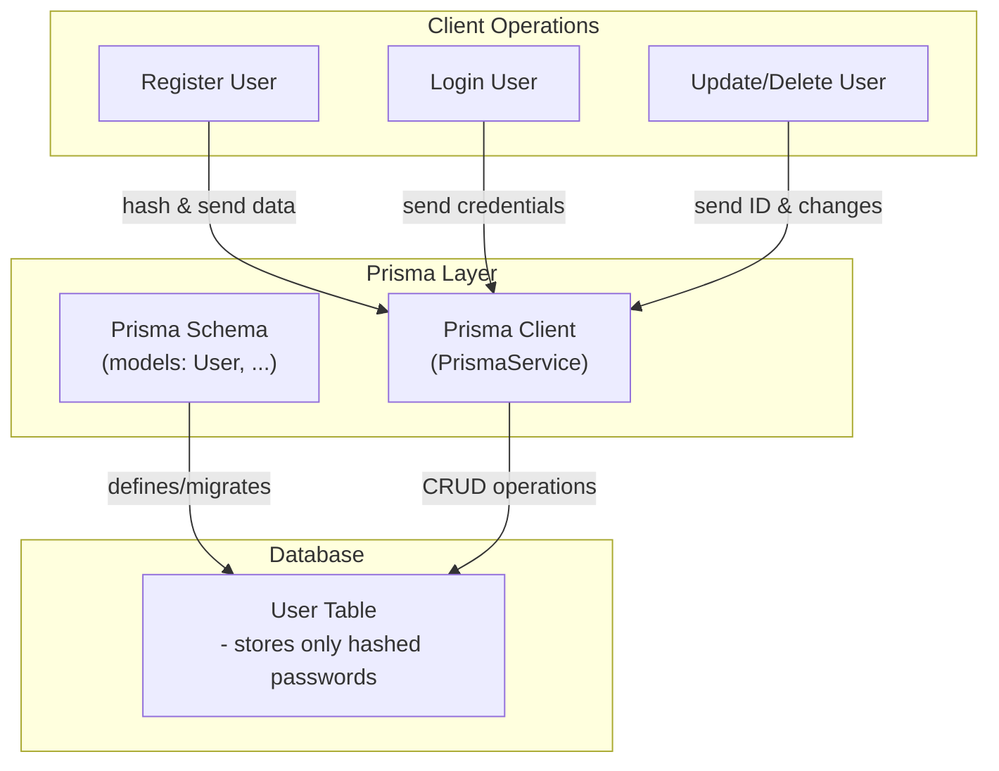
```mermaid
flowchart TB
  subgraph Client_Operations["Client Operations"]
    A["Register User"]
    B["Login User"]
    C["Update/Delete User"]
  end

  subgraph Prisma_Layer["Prisma Layer"]
    D["Prisma Schema<br/>(models: User, ...)"]
    E["Prisma Client<br/>(PrismaService)"]
  end

  subgraph Database["Database"]
    F["User Table<br/>- stores only hashed passwords"]
  end

  A -->|hash & send data| E
  B -->|send credentials| E
  C -->|send ID & changes| E

  D -->|defines/migrates| F
  E -->|CRUD operations| F

```
---

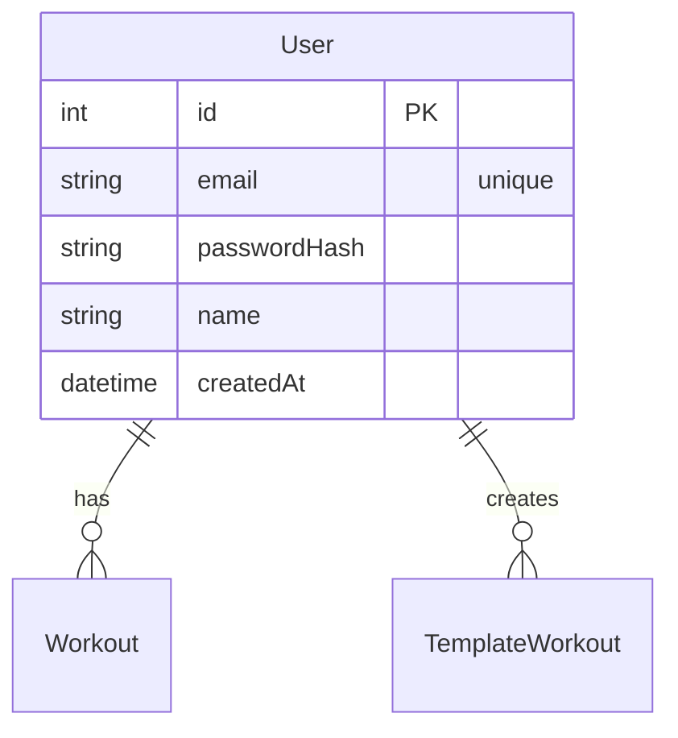
```mermaid
erDiagram
  "User" ||--o{ "Workout" : "has"
  "User" ||--o{ "TemplateWorkout" : "creates"
  "User" {
    int id PK
    string email "unique"
    string passwordHash
    string name
    datetime createdAt
  }

```
---

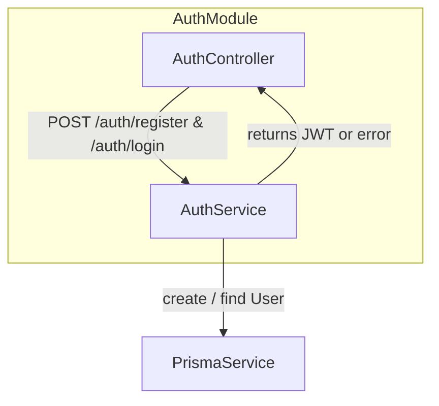
```mermaid
flowchart TD
  subgraph "AuthModule"
    A["AuthController"]
    B["AuthService"]
  end
  C["PrismaService"]
  A -- "POST /auth/register & /auth/login" --> B
  B -- "create / find User" --> C
  B -- "returns JWT or error" --> A

```
---

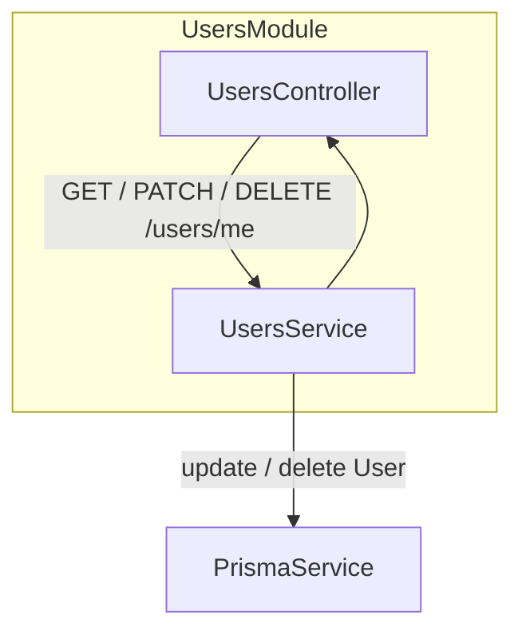
```mermaid
flowchart TD
  subgraph "UsersModule"
    UC["UsersController"]
    US["UsersService"]
  end
  PS["PrismaService"]
  UC -- "GET / PATCH / DELETE /users/me" --> US
  US -- "update / delete User" --> PS
  US --> UC

```
---

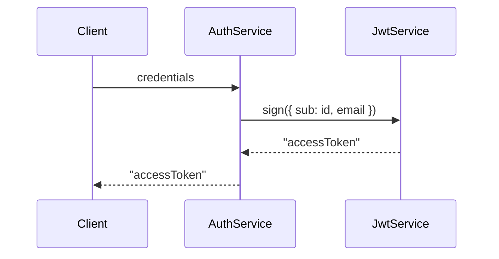
```mermaid
sequenceDiagram
  participant Client
  participant AuthService
  participant JwtService
  Client->>AuthService: credentials
  AuthService->>JwtService: sign({ sub: id, email })
  JwtService-->>AuthService: "accessToken"
  AuthService-->>Client: "accessToken"

```
---
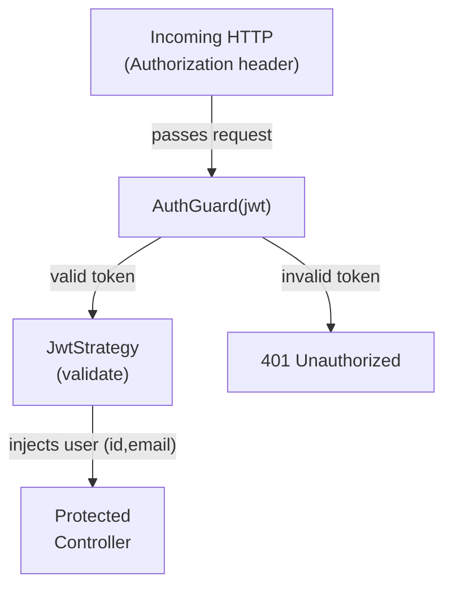
```mermaid
flowchart TB
  Request["Incoming HTTP<br/>(Authorization header)"]
  Guard["AuthGuard(jwt)"]
  Strategy["JwtStrategy<br/>(validate)"]
  Controller["Protected<br/>Controller"]
  Unauthorized["401 Unauthorized"]

  Request -->|"passes request"| Guard
  Guard -->|"valid token"| Strategy
  Strategy -->|"injects user (id,email)"| Controller
  Guard -->|"invalid token"| Unauthorized


```
---

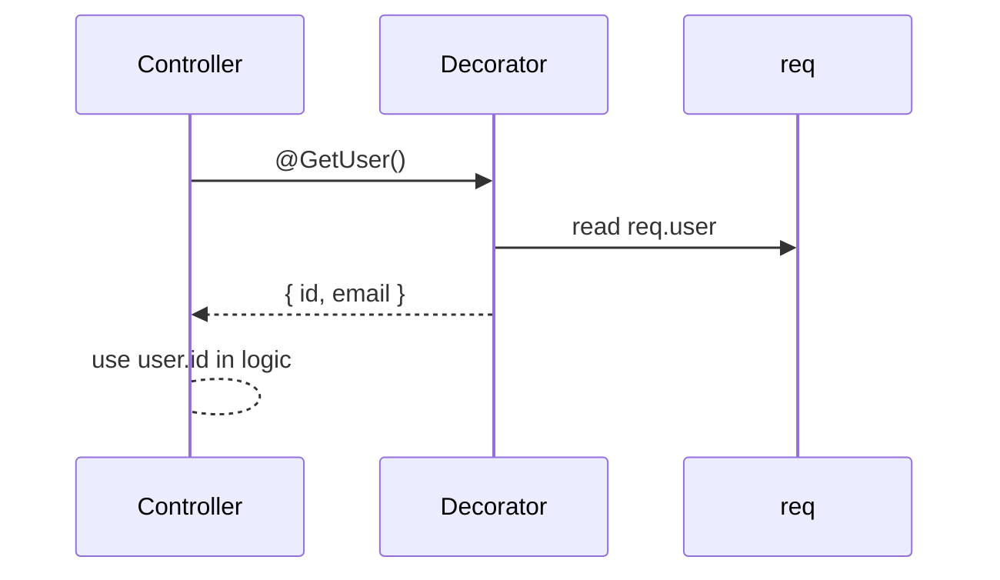
```mermaid
sequenceDiagram
  participant Controller
  participant Decorator
  participant req

  Controller->>Decorator: @GetUser()
  Decorator->>req: read req.user
  Decorator-->>Controller: { id, email }
  Controller-->Controller: use user.id in logic

```

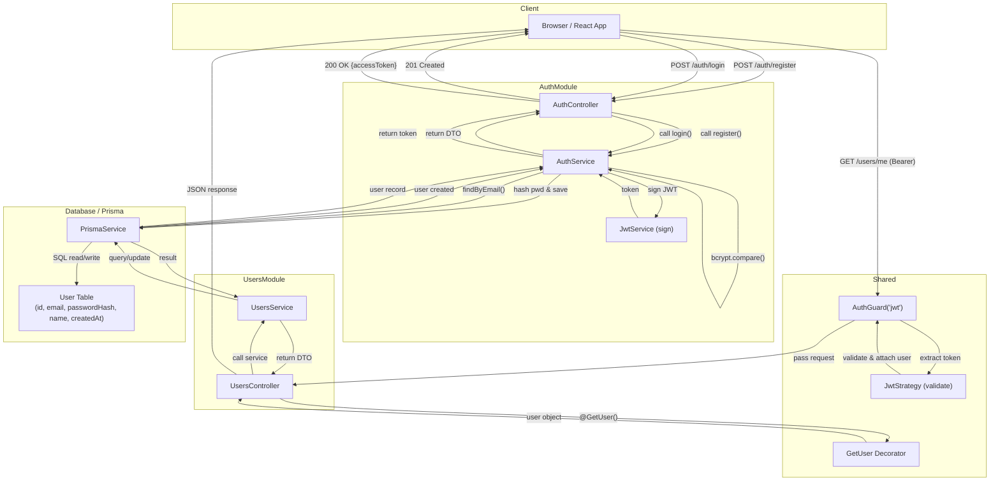
```mermaid
flowchart TD
  %% ─────────────────────────  CLIENT SIDE  ─────────────────────────
  subgraph Client
    C1["Browser / React App"]
  end

  %% ────────────────────────  AUTH MODULE  ──────────────────────────
  subgraph AuthModule
    direction TB
    AC["AuthController"]
    AS["AuthService"]
    JWT["JwtService (sign)"]
  end

  %% ───────────────────────  USERS MODULE  ──────────────────────────
  subgraph UsersModule
    direction TB
    UC["UsersController"]
    US["UsersService"]
  end

  %% ────────────────────────  SHARED LAYER  ─────────────────────────
  subgraph Shared
    direction TB
    Guard["AuthGuard('jwt')"]
    Strat["JwtStrategy (validate)"]
    Decor["GetUser Decorator"]
  end

  %% ─────────────────────────  DATABASE  ────────────────────────────
  subgraph "Database / Prisma"
    Prisma["PrismaService"]
    DB["User Table<br/>(id, email, passwordHash, name, createdAt)"]
    Prisma -- "SQL read/write" --> DB
  end

  %% ===== 1) REGISTER FLOW =====
  C1 -- "POST /auth/register" --> AC
  AC -- "call register()" --> AS
  AS -- "hash pwd & save" --> Prisma
  Prisma -- "user created" --> AS
  AS -- "return DTO" --> AC
  AC -- "201 Created" --> C1

  %% ===== 2) LOGIN FLOW =====
  C1 -- "POST /auth/login" --> AC
  AC -- "call login()" --> AS
  AS -- "findByEmail()" --> Prisma
  Prisma -- "user record" --> AS
  AS -- "bcrypt.compare()" --> AS
  AS -- "sign JWT" --> JWT
  JWT -- "token" --> AS
  AS -- "return token" --> AC
  AC -- "200 OK {accessToken}" --> C1

  %% ===== 3) PROTECTED ROUTE FLOW =====
  C1 -- "GET /users/me (Bearer)" --> Guard
  Guard -- "extract token" --> Strat
  Strat -- "validate & attach user" --> Guard
  Guard -- "pass request" --> UC
  UC -- "@GetUser()" --> Decor
  Decor -- "user object" --> UC
  UC -- "call service" --> US
  US -- "query/update" --> Prisma
  Prisma -- "result" --> US
  US -- "return DTO" --> UC
  UC -- "JSON response" --> C1
```
---
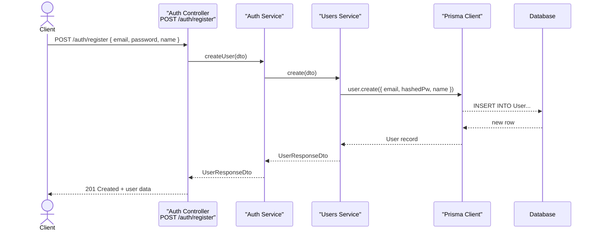
```mermaid
sequenceDiagram
    actor Client
    participant AuthController as "Auth Controller<br>POST /auth/register"
    participant AuthService    as "Auth Service"
    participant UsersService   as "Users Service"
    participant PrismaClient   as "Prisma Client"
    participant DB             as Database

    Client->>AuthController: POST /auth/register { email, password, name }
    AuthController->>AuthService: createUser(dto)
    AuthService->>UsersService: create(dto)
    UsersService->>PrismaClient: user.create({ email, hashedPw, name })
    PrismaClient-->>DB: INSERT INTO User...
    DB-->>PrismaClient: new row
    PrismaClient-->>UsersService: User record
    UsersService-->>AuthService: UserResponseDto
    AuthService-->>AuthController: UserResponseDto
    AuthController-->>Client: 201 Created + user data
```

---
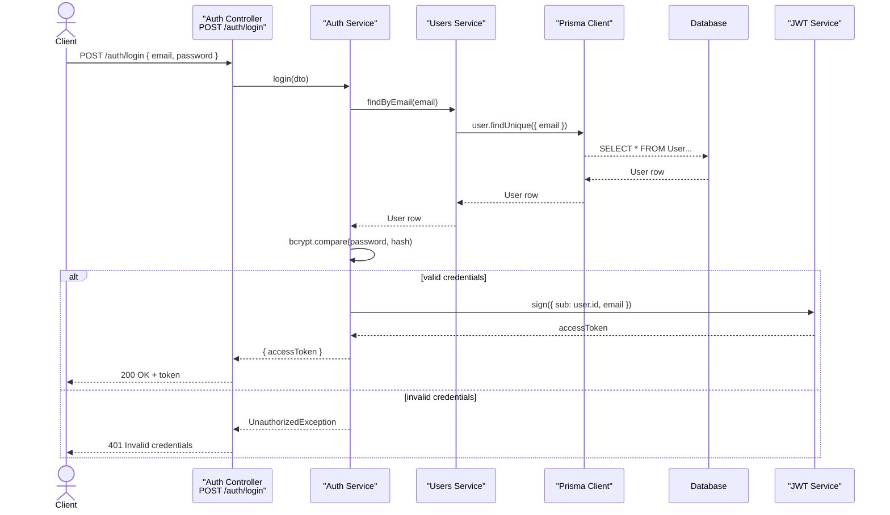
```mermaid
sequenceDiagram
    actor Client
    participant AuthController as "Auth Controller<br>POST /auth/login"
    participant AuthService    as "Auth Service"
    participant UsersService   as "Users Service"
    participant PrismaClient   as "Prisma Client"
    participant DB             as Database
    participant JwtService     as "JWT Service"

    Client->>AuthController: POST /auth/login { email, password }
    AuthController->>AuthService: login(dto)
    AuthService->>UsersService: findByEmail(email)
    UsersService->>PrismaClient: user.findUnique({ email })
    PrismaClient-->>DB: SELECT * FROM User...
    DB-->>PrismaClient: User row
    PrismaClient-->>UsersService: User row
    UsersService-->>AuthService: User row
    AuthService->>AuthService: bcrypt.compare(password, hash)
    alt valid credentials
        AuthService->>JwtService: sign({ sub: user.id, email })
        JwtService-->>AuthService: accessToken
        AuthService-->>AuthController: { accessToken }
        AuthController-->>Client: 200 OK + token
    else invalid credentials
        AuthService-->>AuthController: UnauthorizedException
        AuthController-->>Client: 401 Invalid credentials
    end

```
---
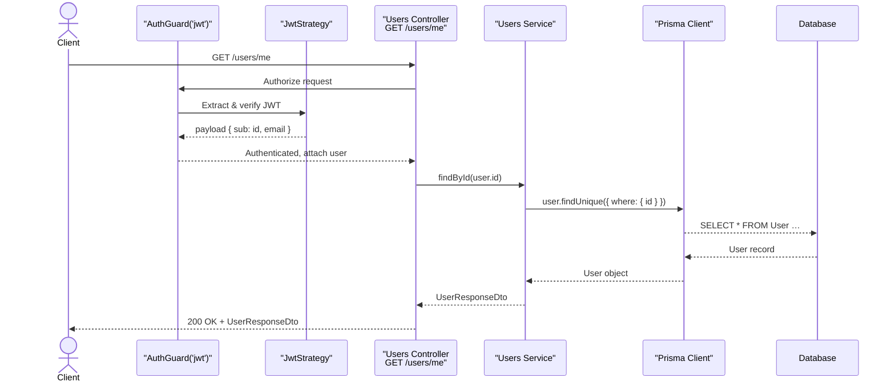
```mermaid
sequenceDiagram
    actor Client
    participant AuthGuard as "AuthGuard('jwt')"
    participant JwtStrategy as "JwtStrategy"
    participant UsersController as "Users Controller<br/>GET /users/me"
    participant UsersService as "Users Service"
    participant PrismaClient as "Prisma Client"
    participant DB as Database

    Client->>UsersController: GET /users/me
    UsersController->>AuthGuard: Authorize request
    AuthGuard->>JwtStrategy: Extract & verify JWT
    JwtStrategy-->>AuthGuard: payload { sub: id, email }
    AuthGuard-->>UsersController: Authenticated, attach user
    UsersController->>UsersService: findById(user.id)
    UsersService->>PrismaClient: user.findUnique({ where: { id } })
    PrismaClient-->>DB: SELECT * FROM User …
    DB-->>PrismaClient: User record
    PrismaClient-->>UsersService: User object
    UsersService-->>UsersController: UserResponseDto
    UsersController-->>Client: 200 OK + UserResponseDto

```

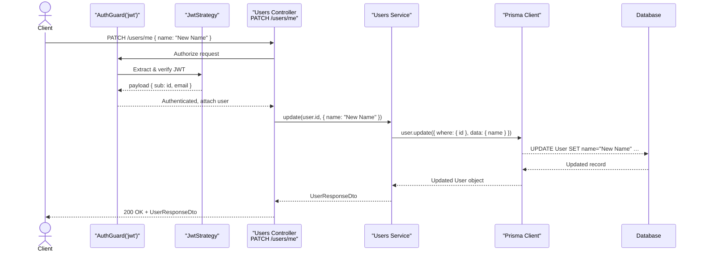
```mermaid
sequenceDiagram
    actor Client
    participant AuthGuard as "AuthGuard('jwt')"
    participant JwtStrategy as "JwtStrategy"
    participant UsersController as "Users Controller<br/>PATCH /users/me"
    participant UsersService as "Users Service"
    participant PrismaClient as "Prisma Client"
    participant DB as Database

    Client->>UsersController: PATCH /users/me { name: "New Name" }
    UsersController->>AuthGuard: Authorize request
    AuthGuard->>JwtStrategy: Extract & verify JWT
    JwtStrategy-->>AuthGuard: payload { sub: id, email }
    AuthGuard-->>UsersController: Authenticated, attach user
    UsersController->>UsersService: update(user.id, { name: "New Name" })
    UsersService->>PrismaClient: user.update({ where: { id }, data: { name } })
    PrismaClient-->>DB: UPDATE User SET name="New Name" …
    DB-->>PrismaClient: Updated record
    PrismaClient-->>UsersService: Updated User object
    UsersService-->>UsersController: UserResponseDto
    UsersController-->>Client: 200 OK + UserResponseDto

```

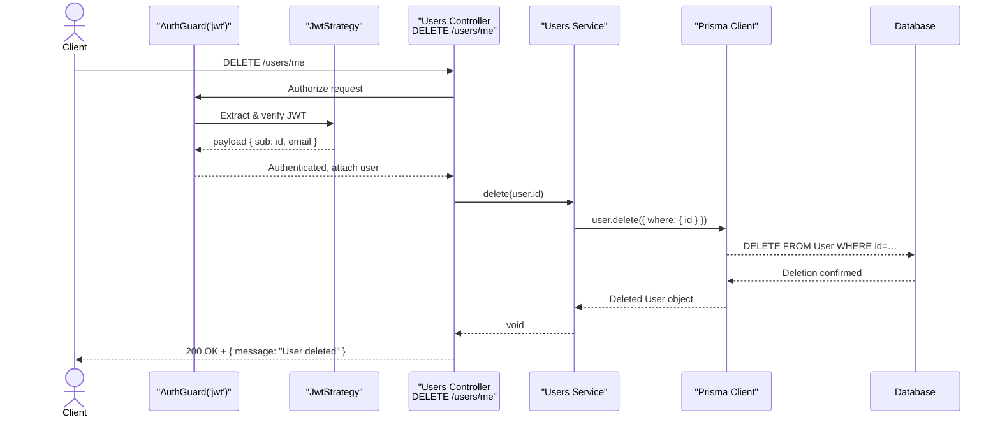
```mermaid
sequenceDiagram
    actor Client
    participant AuthGuard as "AuthGuard('jwt')"
    participant JwtStrategy as "JwtStrategy"
    participant UsersController as "Users Controller<br/>DELETE /users/me"
    participant UsersService as "Users Service"
    participant PrismaClient as "Prisma Client"
    participant DB as Database

    Client->>UsersController: DELETE /users/me
    UsersController->>AuthGuard: Authorize request
    AuthGuard->>JwtStrategy: Extract & verify JWT
    JwtStrategy-->>AuthGuard: payload { sub: id, email }
    AuthGuard-->>UsersController: Authenticated, attach user
    UsersController->>UsersService: delete(user.id)
    UsersService->>PrismaClient: user.delete({ where: { id } })
    PrismaClient-->>DB: DELETE FROM User WHERE id=…
    DB-->>PrismaClient: Deletion confirmed
    PrismaClient-->>UsersService: Deleted User object
    UsersService-->>UsersController: void
    UsersController-->>Client: 200 OK + { message: "User deleted" }

```
