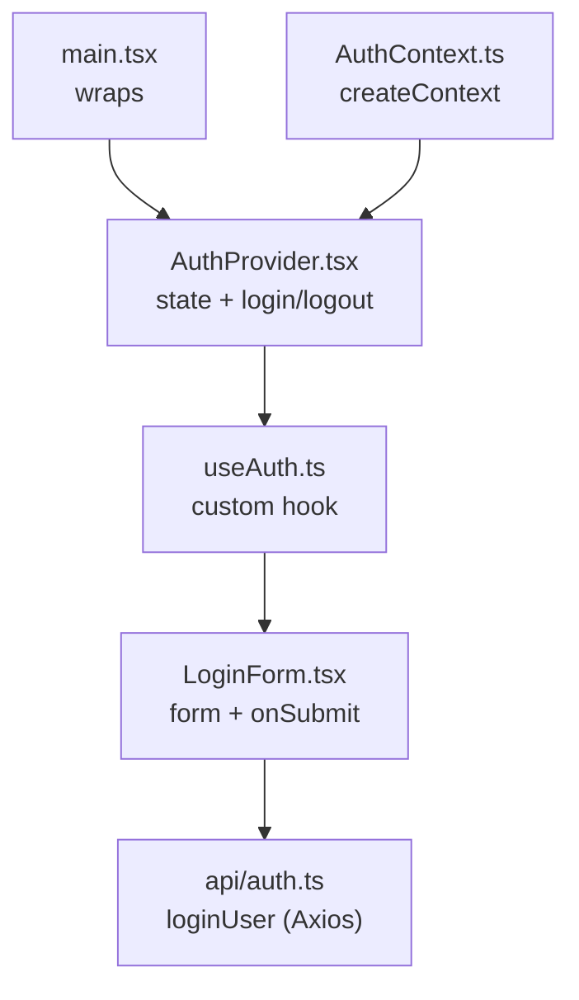

## 🧠 **Current Auth Flow Overview**

### 🔗 **How It All Works Together**

1. **`LoginForm.tsx`** (in `components/auth`)
    
    - Renders a login form
        
    - Validates inputs with Zod + RHF
        
    - Submits credentials to the backend via `loginUser()`
	    - `loginUser()` can be found in `auth.ts`
        
2. **`auth.ts`** (in `api`)
    
    - Sends a POST request to `/auth/login`
        
    - Returns `{ accessToken }` from the server
        
3. **`AuthProvider.tsx`** (in `context`)
    
    - Manages auth state: stores the token, hydrates it on load
        
    - Provides `login()` and `logout()` functions
        
4. **`AuthContext.ts`** (in `context`)
    
    - Defines the structure and default value for the auth context
        
5. **`useAuth.ts`** (in `hooks`)
    
    - Custom hook to access context from any component with one line:
```ts
const { login, isAuthenticated } = useAuth()
```
6. `main.tsx`
	- Wraps the app in `<AuthProvider>` so the whole tree has access to auth state


